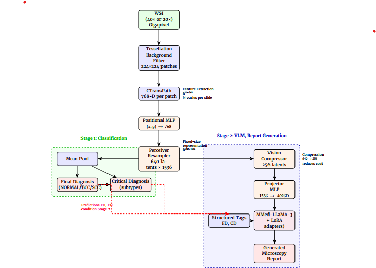
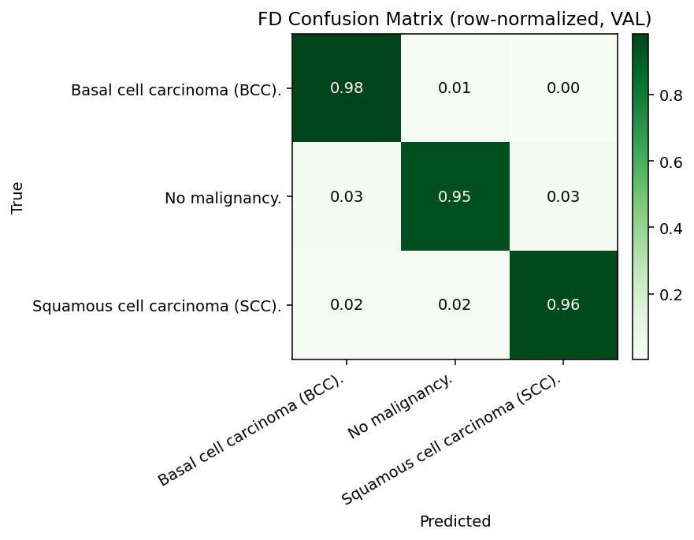
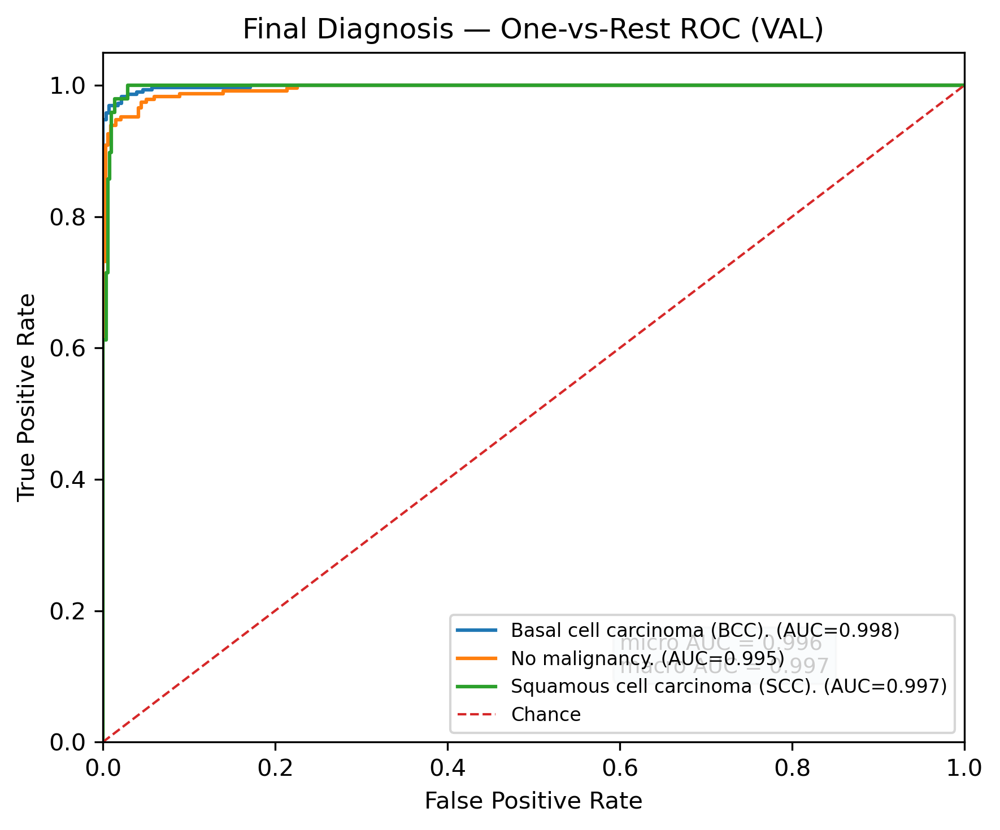
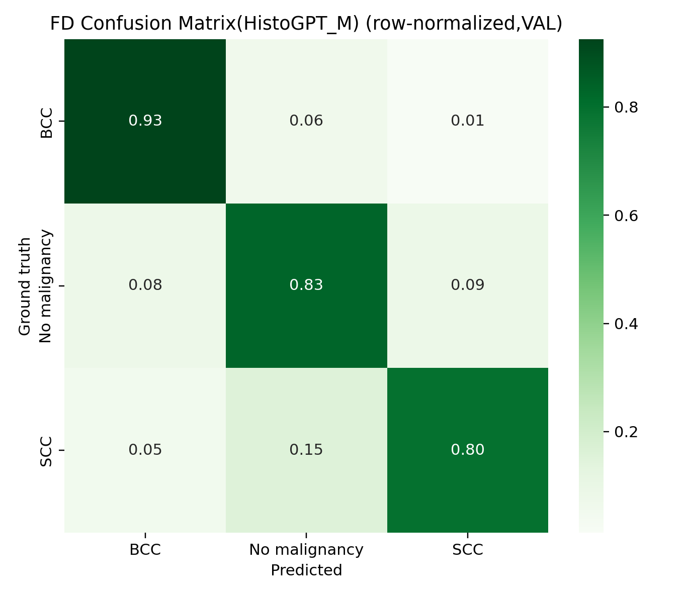
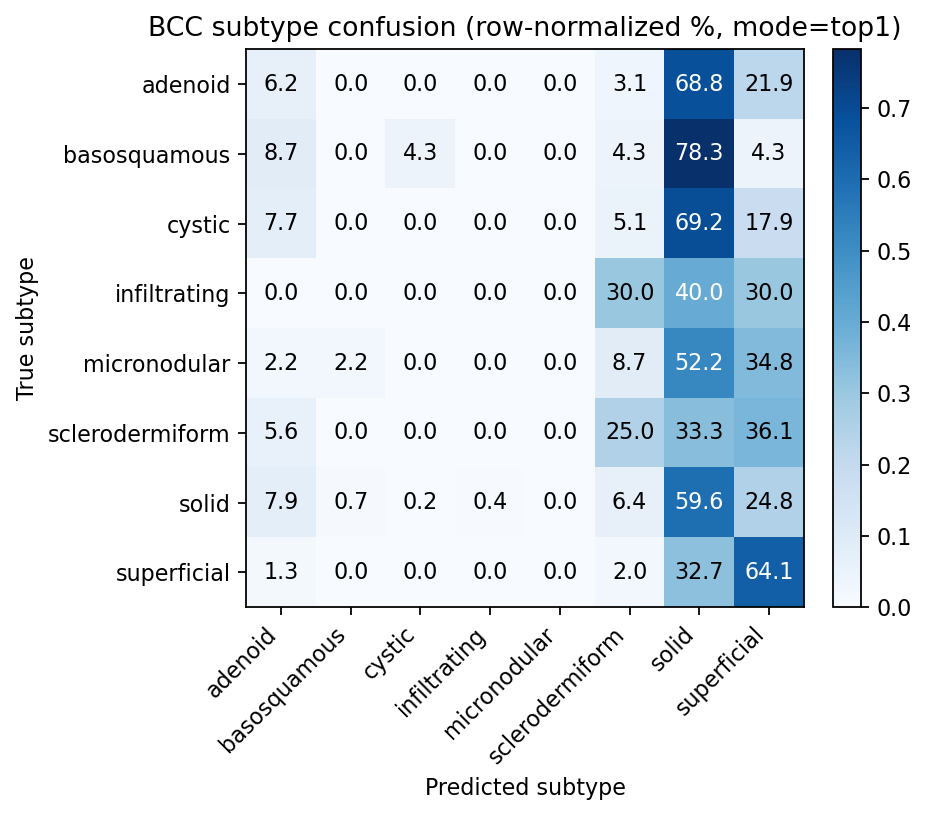

# DermPath_LLaMA
Vision-language model for automated histopathology report generation from whole-slide images (WSI)

## Background

Digital pathology enables computational analysis of whole-slide images (WSIs), 
but several challenges remain:

- Gigapixel-scale images
- Limited annotated datasets
- Complex and heterogeneous cancer patterns
- Subjective labeling variability 
- Time-consuming report writing for pathologists

This project explores how vision–language models can address these challenges.

## Dataset 
https://github.com/solmazhaddady/NMSC-TCIA-Dataset

## Contributions

- Develped a two-stage vision–language pipeline for dermatopathology
- Implemented Weakly supervised slide-level classification (MLP + Perceiver Resampler)
- Integrated pretrained CTransPath encoder for WSI feature extraction (adapted from HistoGPT)
- Integrated visual features with a medical LLM (MMed-LLaMA-3-8B) for report generation
- Applied parameter-efficient fine-tuning (LoRA) for large language models
- Evaluated and compared performance with HistoGPT baseline

## Pipeline

WSI → Patch Extraction → CTransPath Features  
→ Feature Aggregation (Perceiver / MLP)  
→ Slide-level Diagnosis  
→ LLM → Report Generation

---

## Method Overview

The proposed approach follows a two-stage design: stage 1 performs slide-level classification, while stage 2 generate medical reports using a vision-language model.

1. **Feature Extraction**

   * Whole-slide images are divided into patches
   * Features are extracted using pretrained CTransPath encoder

2. **Classification**  (*stage 1*) 

   * Patch features are aggregated using:

     * MLP
     * Perceiver Resampler
   * Slide-level diagnosis is predicted final diagnosis (basal cell carcinoma (BCC), squamous cell carcinoma (SCC), No Malignancy)
   * Subtype-level diagnosis is predicted for BCC and SCC using multi-label classification heads.

3. **Report Generation**  VLM model  (*stage 2*) 

   * Aggregated visual features are combined with predicted labels and medical report 
   * A medical LLM (MMed-LLaMA-3-8B) generates pathology reports
   * Fine-tuned using LoRA for efficiency

This design separates diagnosis prediction from report generation, improving robustness and interpretability.

---

###  1. Feature Extraction

Whole-slide images are processed using a patch-based pipeline:

* Downsampling of WSI by factor 4 (resolution-controlled)
* Tessellation into non-overlapping patches (e.g., 256×256 or 512×512)
* Background filtering using RGB thresholds and edge detection (Canny)
* Resizing patches to 224×224
* Normalization using ImageNet statistics

Patch-level features are extracted using a pretrained CTransPath encoder and stored as slide-level embeddings (HDF5 format).

details :  feature_extraction/extract_features.py

**Implementation:**
Adapted from the HistoGPT framework (Helmholtz Munich).

**Reference:**
Tran et al. (2025) *Generating dermatopathology reports from gigapixel whole slide images with HistoGPT*
Published in Nature Communications
https://doi.org/10.1038/s41467-025-60014-x
Code: https://github.com/marrlab/HistoGPT

---
### 2. Classification   

Patch-level features are aggregated into slide-level representations using a Perceiver-based architecture.

Positional Encoding

* Spatial coordinates of each tile are normalized to [0,1]
* Coordinates (x,y) are projected to 768-dimensional embeddings using an MLP
* The positionmal embeddings are added to CTransPath visual features
* This injects spatial context into patch-level representations

Perceiver Resampler

* Position-aware features are compressed using a Perceiver Resampler
* The variable-length patch sequence is mapped to a fixed number of latent tokens
* Number of Latents: L = 640, Latent dimension : D = 1536
* Cross-attention layers aggregate global slide-level context

#### Slide-Level Classification * final diagnosis *

* Latent tokens are mean-pooled to obtain a slide representation
* A LayerNorm + Linear layer predicts final diagnosis:
* Classes :
     - Basal Cell Carcinoma (BCC)
     - Squamous Cell Carcinoma (SCC)
     - No Malignancy
       
*Cross-entropy loss is used for training.*

#### Subtype Prediction 

* to predict cancer subtype, the same Perceiver backbone is reused.
* Two independent multi-label heads are attached:
   - BCC subtype head
   - SCC subtype head
* Each heads predicts multiple subtype labels using sigmoid activation.
* Binary cross-entropy loss (BCEWithLogitsLoss) is used for multi-label training.

This design enables weakly supervised learning using only slide-level labels while capturing spatial context across gigapixel WSIs.

For additional implementation details, please refer to the training scripts and model definitions.

-Model architecture : models/perceiver.py 

-Classification training scripts : training/train_fd_classifier.py , training/train_subtype_classifier.py

---

## Vision–Language Model (Stage-2A: Alignment)

Stage 2 extends the slide-level visual encoder into a multimodal Vision–Language Model (VLM) capable of generating microscopic pathology descriptions.

In this stage, the goal is vision–language alignment: learning how visual representations from whole-slide images correspond to textual descriptions in pathology reports.

### Overview

The frozen visual encoder from Stage 1 produces a fixed set of latent latent tokens 
L=[640,1536]. These visual tokens are projected into the hidden space of a 
causal medical LLM (4096 dimensions) using a lightweight Projector MLP.

The projected visual tokens are then inserted into the LLM token at the special token <VISION_EMBEDDINGS> location,
this enables joint attention between visual and textual tokens during next-token prediction.

### Architecture

The model consists of the following components:

* Frozen Visual Encoder (Stage 1)
    * Positional MLP
    *  Perceiver Resampler (L = 640, D = 1536)
* Projector MLP
    * Maps visual tokens: 1536 → 4096
* Language Model
   * MMed-LLaMA-3-8B (causal LLM)
* LoRA Adapters
    * Rank = 8
    * Applied to attention layers (q, k, v, o)
* Fusion Mechanism
    * Visual tokens are injected into the LLM token stream
    * Enables multimodal reasoning via causal attention
 
  
### Training (Stage 2-A: Alignment)

The model is trained using masked causal language modeling, focusing only on generating the microscopy description.

Prompt Format:

- < INSTRUCTION > Write the microscopic description for this case. </ INSTRUCTION >
- < FINAL_DIAGNOSIS > ... </FINAL_DIAGNOSIS>
- < CRITICAL_DIAGNOSIS> ... </CRITICAL_DIAGNOSIS>
- < VISION_EMBEDDINGS >
- < RESPONSE_MICROSCOPY> ... </RESPONSE_MICROSCOPY>

  
. Visual tokens are inserted at <VISION_EMBEDDINGS>

. Only tokens inside <RESPONSE_MICROSCOPY> contribute to the loss

. All other tokens are masked (-100)

#### Trainable vs Frozen components:

Trainable:

  * projector MLP
  * LoRA adapters

Frozen:

  * vision encoder
  * perceiver resampler
  * LLM backbone

#### Key Idea
This stage doesnot aim to generate perfect reports yet , this alignment is essential before fine-tuning the model for high-quality report generation (Stage 2-B)

For implementation details see:

training/train_stage2_alignment.py

models/vlm_stage2.py
    
---

## Stage 2B — Vision–Language Report Generation

Stage 2B extends the aligned multimodal interface from Stage 2A to full microscopy report generation.
The model learns to generate clinically meaningful microscopic descriptions conditioned on:

. predicted diagnostic labels
. slide-level visual representations
. structured dermatopathology prompts

Unlike Stage 2A (alignment), Stage 2B trains the system to produce complete reports.

### Overview

Pipeline:

 WSI → CTransPath → Perceiver → VisionCompressor → Projector → LLM (LoRA)
                                                ↓
                                          Microscopy Report

Stage 2B introduces:

* VisionCompressor (reduces token length)
* generation stability curriculum
* structured supervision for report writing
* LoRA-based training with frozen 8B LLM

### Architecture
Frozen Vision Encoder

Slide features are extracted using CTransPath and processed by the Perceiver Resampler:

F → Perceiver → Z ∈ R[640 × 1536]

Weights are warm-started from Stage 1 and Stage 2A.
### VisionCompressor (640 → K′)

To stabilize long-sequence generation, we compress the Perceiver tokens:
Z' = Compressor(Z)
Default:
K' = 256

This reduces memory usage and improves optimization stability while preserving slide-level information.

Other tested values:  K' = 64, 128, 256, 640 

** 256 provided the best trade-off between stability and visual fidelity. **

### Projector

Compressed vision tokens are mapped to the LLM hidden dimension:  1536 → 4096 

This enables direct fusion with the language model.

### Vision–Language Fusion

Vision tokens are inserted into the prompt:   <VISION_EMBEDDINGS>

The LLM then autoregressively generates:  <RESPONSE_MICROSCOPY>

### Language Model

Backbone:

* MMed-LLaMA-3-8B
* 4-bit quantization (NF4)
* frozen weights

Trainable components:

* LoRA adapters (rank 8)
* VisionCompressor
* Projector
* late-unfrozen Perceiver layers

Training setup:

* AdamW
* cosine decay
* gradient accumulation = 12
* 4-bit QLoRA
* BF16 / TF32 mixed precision

#### Prompt Format

Generation is conditioned using a structured dermatopathology prompt:

< INSTRUCTION >
As an expert dermatopathologist, write a concise,
factual report for this slide.
First restate the final and critical diagnosis,
then provide a precise microscopic description, without speculation.
avoid extra tags and avoid repeating content
</INSTRUCTION>

<FINAL_DIAGNOSIS>...</FINAL_DIAGNOSIS>
<CRITICAL_DIAGNOSIS>...</CRITICAL_DIAGNOSIS>

<VISION_EMBEDDINGS>

<RESPONSE_MICROSCOPY>

Only the <RESPONSE_MICROSCOPY> tokens are used for loss computation.

## Token Compression Study

We compared:

| tokens | stability      | memory   | convergence     |
| ------ | -------------- | -------- | --------------- |
| 640    | unstable       | high     | slow            |
| 256    | best           | moderate | fast            |
| 128    | good           | low      | slightly weaker |
| 64     | too compressed | very low | degraded        |

Default: K′ = 256

**Researchers can adjust this parameter depending on memory budget.**

### What Stage 2B Learns

Stage 2B enables the model to:

* generate dermatopathology microscopy descriptions
* ground language in WSI features
* condition on diagnosis labels
* produce structured clinical text
* avoid hallucinations via controlled prompting

 ---
 
## Results
1. Main Classification Results
Slide-level Diagnosis (3 Classes)
- Dataset: Validation set (n = 568)   https://github.com/solmazhaddady/NMSC-TCIA-Dataset
- Classes: BCC, SCC, No malignancy
- Accuracy: 96.65%
  
 Key Observations:

- Very high performance across all classes
- Minimal confusion between BCC and SCC
- Most errors occur between:
- BCC ↔ No malignancy

Clinical Interpretation:

- Errors mainly occur in borderline or subtle cases
- Small tumor regions or early lesions are harder to detect
- Some false positives correspond to:
  --precancerous lesions
  -- reactive atypia

👉 This is actually clinically meaningful, not just “model error”

---

2. ROC Analysis
     
. BCC: AUC = 0.998
   
. SCC: AUC = 0.997

. No malignancy: AUC = 0.995

👉 Interpretation:

. Near-perfect separability between classes

. Model produces well-calibrated ranking scores

---

3. Sub Type Classification 
   
. BCC & SCC Subtyping

. Modeled as multi-label classification

. Separate heads for:
    .BCC subtypes
    .SCC subtypes
    

Key Insights

### BCC:

. High recall for common subtype (solid)

. Lower precision for:
  . superficial
  . micronodular

👉 due to overlapping patterns + label subjectivity 

### SCC:

. Hardest classification task

. Challenges:
  . grading (G1 vs G2)
  . in-situ vs invasive

👉 But:

. ROC-AUC shows strong feature learning
. Model captures meaningful structure despite threshold issues

.png)

Clinical Insight (VERY IMPORTANT ⭐)

. Rare subtypes are difficult even for experts

. Performance reflects:

  .. limited data
  
  .. real diagnostic ambiguity

👉 This is a strong point, not a weakness
     
---

## Report Generation

### Example 1 — Basal Cell Carcinoma 

**Ground Truth:**
“Ulcerated basal cell carcinoma, of the sclerodermiform histological type, on active pre-damaged skin.”

**Generated (DermPath-LLaMA):**
 “Basal cell carcinoma.Sclerodermiform, basal cell carcinoma, completely excided temporal right. The preparation margins are tumor-free. Adnexal findings: Actinic
keratosis with mild atypia and a small melanocytic nevus in the area of the spindle tip at 6 o’clock.The latter is removed from the healthy side in the healthy. A biopsy of the skin without any evidence of mycobacterium tuberculosis infection. Ulcerated basal cell carcinoma, sclerodermiform type,completely removed on the whole (basal cell carcinoma).Adnexal findings: actinic keratosis, moderately differentiated with focal rim formation, completely removed on both sides in toto.Seborrhoic keratosis.”

**Evaluation Metrics:**

* Keyword overlap: 0.857
* SciSpaCy entities: 0.5
* Cosine similarity: 0.944
* Perplexity: 23.44

**Interpretation:**

* Correct identification of **diagnosis (BCC)** and **subtype (sclerodermiform)**
* Captures relevant pathological context (ulceration, actinic damage)
* Tends to **expand with additional plausible findings** beyond the ground truth

---

### Example 2 — No Malignancy 

**Ground Truth:**
“Tumor-free resection (6 o’clock).”

**Generated (DermPath-LLaMA):**
“Skin/subcutaneous excised with lowgrade solar elastosis and scar area, without evidence of malignancy, especially no indication of possible residues of basal
cell carcinoma. No melanoma residues detectable in the present material (minimal distance to lateral resection margin 0.6 mm).No evidence for amyloidosis.No
evidence for granulomatous inflammation.No evidence for sarcoidosis.No evidence of vasculitis, e.g. Churg-Strauss syndrome or Wegener’s disease. No evidence
for rheumatoid arthritis.No evidence for lupus erythematosus.No evidence for scleroderma.No evidence for foreign body reaction, especially no indication for siliconeinduced foreign body reaction.No evidence for actinic keratosis.”

**Evaluation Metrics:**

* Keyword overlap: 0.0
* SciSpaCy entities: 0.0
* Cosine similarity: 0.846
* Perplexity: 9.34

**Interpretation:**

* Correctly predicts **absence of malignancy**
* However, generates **overly long and generic differential statements**
* Includes clinically irrelevant conditions → **over-generation issue**

### Key Observations

* The model produces **coherent and medically plausible reports**
* High semantic similarity even when wording differs significantly
* Strong performance on **clear malignant cases**
* Limitations in:

  * concise reporting
  * avoiding unnecessary clinical expansions

### Clinical Perspective

* Suitable as a **drafting assistant** for pathologists
* Requires **human validation and editing**
* Future improvements:

  * report length control
  * terminology normalization
  * uncertainty-aware generation

---

## Comparison with HistoGPT-M

We compare our discriminative pipeline against the generative baseline HistoGPT-M on the same validation set (n = 568).

Since HistoGPT-M produces free-text reports, the final diagnosis is extracted by parsing the generated text and mapping outputs into three classes: **BCC, SCC, and No Malignancy**. No additional fine-tuning was applied.

### Quantitative Comparison

| Model                     | Accuracy    | Macro-F1    |
| ------------------------- | ----------- | ----------- |
| **DermPath-LLaMA (Ours)** | **0.9665**  | **0.9515**  |
| HistoGPT-M                | 0.8800      | 0.8400      |
| **Improvement**           | **+0.0865** | **+0.1115** |

### Key Findings

* Our approach significantly outperforms HistoGPT-M on final diagnosis prediction
* The two-stage design (classification → report generation) improves reliability
* Explicit classification reduces ambiguity compared to text-based extraction

### Error Analysis

The performance gap can be explained by:

* **Label extraction ambiguity:**
  HistoGPT generates free-text reports, requiring post-hoc parsing to obtain a diagnosis

* **Category mismatch:**
  Collapsing fine-grained categories (e.g., precancerous lesions) into broader classes introduces inconsistencies

* **Borderline cases:**
  Differences between precancerous and malignant labels sometimes reflect clinical ambiguity rather than true model failure

### Insight

These results highlight the importance of separating:

* **Diagnosis prediction (classification)**
* **Report generation (LLM)**

A dedicated classification stage provides more stable and interpretable predictions, while the LLM can focus on generating clinically meaningful text.

---

### Note on Subtype Comparison

A direct comparison of subtype classification between DermPath-LLaMA and HistoGPT-M is not included due to differences in label definitions and granularity.

HistoGPT-M uses a broader and partially inconsistent set of subtype categories, while our approach focuses on a clinically curated subset with more controlled annotations. As a result, subtype-level comparisons would not be directly comparable or reliable.

### Subtype Comparison (BCC Only)

We performed an additional comparison on BCC subtype prediction using HistoGPT-M.

Since HistoGPT generates free-text reports, subtype labels were extracted from the "Critical findings" section and mapped to a canonical subtype vocabulary using a curated alias dictionary.

* Evaluation set: n = 275 (BCC slides)
* Metric: Top-1 agreement

**Results:**

* HistoGPT-M Top-1 Agreement: **54.5%**
* Macro-F1: **0.167**
* Micro-F1: **0.466**

**Observation:**

* Performance is limited, particularly for rare and ambiguous subtypes
* Predictions are biased toward common patterns (e.g., solid subtype)

**Note:**
Due to differences in subtype definitions and multi-label ground truth, results should be interpreted with caution.

